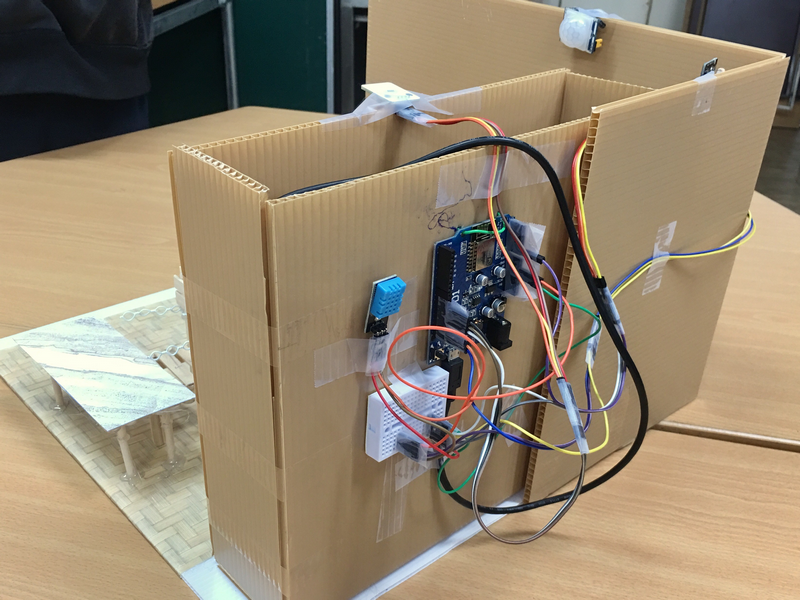
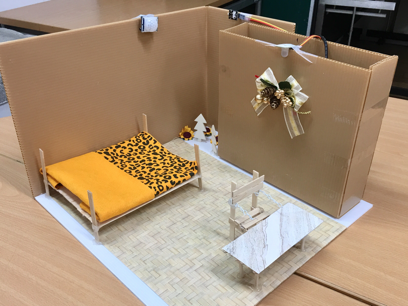
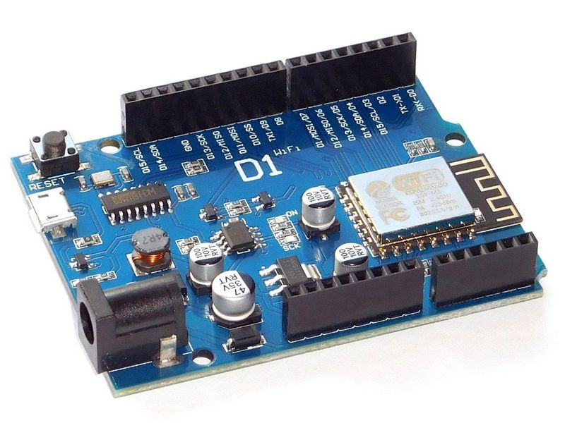
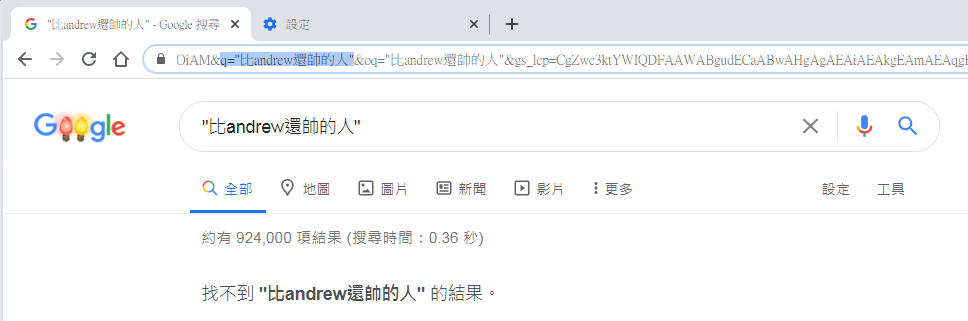
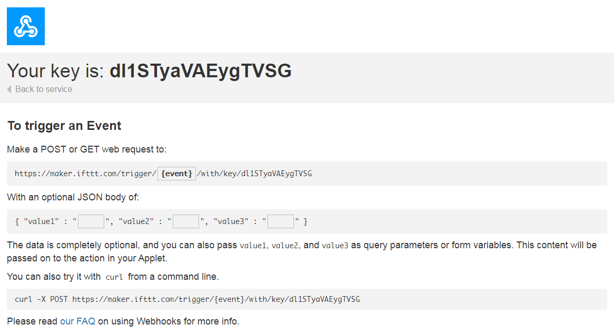

# Smart Home 原型製作


## 關於這個 repo

這個 repo 是為了配合朋友的教案所寫的 demo 系統。由於我只有三個下班後的晚上能實作它，所以它不算是個很完整的系統，程度只到 "能展示概念" 而已。也因為只是 demo 用途，所以目前也不會再更新它了。

對教案有興趣的，可以看 [Home-Automation_draft.pdf](Home-Automation_draft.pdf) 了解當初設計的初始想法（筆記用的，不算正式的投影片）。目的是讓學生了解一個智慧系統是由多個感測器互相組合而成的。








## 開發板

使用的開發板是 WeMos-D1-R1。pinout/ 內有兩張圖檔說明它的 pinout 配置。使用這張開發板的原因是因為它長得就是 Arduino UNO 的樣子，對初學者來說或許比較熟悉些。它的主要控制晶片是具有 WiFi 功能的 ESP8266，所以可以連網做些 IoT 的應用。但如果我自己要做的話，我會選像是 D1-mini 這樣較小巧的開發板，或是乾脆直接使用 ESP32 的開發板。




開發環境我目前使用 arduino-1.8.8。如果你在更新版的 Arduino IDE 中遇到問題，可以試著退回這一版做驗證。


## 感測器

因為是 demo 用的，目前只使用這幾個便宜又容易取得的感測器:

* (輸入) PIR 人體紅外線感測器
* (輸入) 光敏電阻模組
* (輸入) DHT11 溫溼度感測器
* (輸出) RGB 三色 LED 燈模組


## 連網 -- IFTTT

我所使用的是 [IFTTT](https://ifttt.com/explore) 的服務，你可以把 IFTTT 視為一個能整合不同服務的平台。IFTTT 事實上是 IF...THEN 的意思，你可以把 IF 當作是輸入，THEN 當作是收到輸入後的輸出行為。

我在 IFTTT 上建立了一個「IF `收到 WebHook 的請求`，THEN `轉送到 LINE 的某個群組`」的 Applet。這個 Applet 就會是一個結合 WebHook 和 LINE 兩種服務的新服務，這就是 IFTTT 的原始用意。我記得早期 IFTTT 稱這種 mix 的新服務為 Recipe，現在似乎改稱為 Applet。但從 "Recipe" 的字義上，反而更能夠了解它的用意。


	[WebHook] + [LINE Notify] = My Applet (Recipe)


整體的運作方式是這樣的：你需要寫個的程式對 IFTTT 提供的 "WebHook URL" 送出 HTTP request。這個 request 會夾帶你的訊息，訊息的內容可能是房間內的溫溼度資訊，或是房間內有沒有人。IFTTT 會將你夾帶的資料轉送給你的 LINE Notify 服務。最後你就可以在手機上收到 LINE 訊息了。


ps: 先不要擔心 "夾帶訊息" 的事情，後面我會用個簡單的例子說明。


	[code running in arduino]==>((HTTP GET/POST))==>[WebHook from IFTTT]==>[LINE Notify]==>[your phone App]


把上面的流程展開來，你可以知道你要處理三個部分：


1. 寫個程式夾帶訊息送給 IFTTT 上的 WebHook
2. WebHook 將訊息轉送給 LINE 通知服務
3. LINE 通知服務將訊息推到你的手機


其中，2) 的部分是 IFTTT 做的，你只需要在網站上設定即可。所以你真正要處理的部分只有 1) 和 3)。我會建議你先處理 3) 的部分，因為那個部分與程式碼無關。而且 3) 處理完之後，你甚至可以在開始寫程式之前就先測試整個流程。

為了處理 3)，你需要取得 LINE Notify 的授權。方法很簡單，只要去 [LINE Notify](https://notify-bot.line.me/zh_TW/) 官方申請就好。申請成功後，你的 LINE 好友清單中會多一位叫做 LINE Notify 的機器人。

通常使用 LINE Notify 的方式是：你先建立一個聊天群組，然後把 LINE Notify 機器人連同任何想收到通知的人都加入群組。例如你做的是智慧家庭的應用，你可能會想把你的家人也加入群駔。當訊息推播給 LINE Notify 的時候，群組裡面的人就會收到通知。

完成後，你就只剩下 1) 的部分要處理了。

你要先了解如何使用 WebHook 提供的 "REST-Api"，其實這個名詞沒有那麼艱澀，實際上真正做的事情就是對某個 URL 送出一個 HTTP 的 GET 或是 POST。GET 就像是你在網址列上輸入 URL 然後按 Enter 前往。POST 就像你在網頁上填好問卷後按了傳送。而 WebHook 同時支援這兩種方式。目前我們的選擇是 GET。


### HTTP GET

說明一下「透過 HTTP GET 夾帶訊息給 WebHook」這件事是什麼意思？其實你一直在使用它。每當你使用 Google 搜尋關鍵字時，其實你就將你的關鍵字當作夾帶訊息，然後以 HTTP GET 的方式送給 Google 伺服器，然後 Google 再將搜尋結果回傳到你的瀏覽器上。

例如，你在 google 上搜尋 "比andrew還帥的人"，雖然 google 會告訴你 "找不到比andrew還帥的人"，但這不是重點 XD。重點是往上看你瀏覽器的網址列。如果你仔細看那段 URL 字串的規則，你會發現其實它含有一堆以 `&` 連接的資料，例如下圖中的 `&q="比andrew還帥的人"` 表示傳了 `q` 給這個參數給 Google 伺服器。所以伺服器那端會有一段程式，從 q 將使用者輸入的關鍵子取出做處理。



不用擔心這個部分，就算你聽不懂上面這一小段的說明，你還是可以做出 demo 系統的。


好！拉回來說 XD 只要進入 IFTTT 的 WebHook 設定頁面，就可以線上測試 WebHook 的呼叫。這讓你在尚未寫任何一行程式之前，就能先測試從 WebHook 到 LINE Notify 這段路徑是不是通的。





WebHook 提供的測試方式不但可以使用 curl 發送，還可以直接在瀏覽器上貼上 URL 測試，你可以試試看在網址列上貼上下面的 URL (需要更改 even name 和 key):

	https://maker.ifttt.com/trigger/{你的event name}/with/key/{你的key}?value1=111&value2=222&value3=333


如果你的 LINE 有收到通知（應該會有 111, 222, 333），就能證明這整段都是打通的。然後，你就可以 "寫程式幫你做你剛剛手動測試時所做的事情"。

ps: 另外，你有沒有注意到上面的 URL 也是以 `&` 相連的？是的，它就是一種 HTTP GET resuest。 


## 程式碼

開發板上的控制晶片是 ESP8266，但是使用的開發環境是 Arduino IDE。由於原生的 Arduino 開發環境是不支援 ESP8266 的，所以你需要知道如何讓你的 Arduino IDE 也能夠開發 ESP8266。方法很簡單，請以 "http://arduino.esp8266.com/stable/package_esp8266com_index.json" 這整段為關鍵字在 google 上搜尋教學文章，或是以 "Arduino" "ESP8266" 在 Youtube 上搜尋影片就能找到詳細的教學。 


這個 repo 上有幾個資料夾，其中有 "Test_" 開頭的資料夾是為了測試感測器所寫的測試程式。真正整合在一起的程式是下面這三支程式。以下條列的順序就是我開發的進版的順序，你可以使用任何文件比對工具看出我在每一次版本進版時加了什麼東西。

* Smart_Home -- 最基本的感測控制展示，沒有連網
* Smart_Home_IoT -- 將 Smart_Home 加入連網後的版本
* Smart_Home_IoT_v2 -- 在細部處理 PIR 之後的版本，也是最終 demo 的版本


我必須說其實還不是很滿意這個程式，不管是在流程的控制上或是寫法上都不夠好。但如果這個原型可以幫助到想入門的人，就請盡情拿去修改吧！


## 程式碼需要修改的部分

以下皆以 Smart_Home_IoT_v2 說明。

### WiFi 連線

如果你要改 wifi 的 SSID 和密碼，修改這裡：

```
#ifndef STASSID
#define STASSID     "andrew"
#define STAPSK      "1234567890"
#endif
```


你其實可以增加很多組 ssid/password。只需要將他們一一 addAP() 進去即可，方法如下：

```
  WiFiMulti.addAP("-andrlin", "1234567890");
```

比較好的實作方式就是寫一個陣列，然後在初始化的時候一一將他們都 add 進去。


### IFTTT 連網

我在程式碼中使用簡單的 HTTP GET 夾帶資料給 WebHook，相關的程式片段如下：

你需要改的是 "i-smart-home" 和 "dl1STyaVAEygTVSG" 這兩個字串，他們分別是 event name 和 key。比較好的寫法是將 event name 和 key 定義為變數。


```
  client.print("GET /trigger/i-smart-home/with/key/dl1STyaVAEygTVSG?value1=" + value1 + "&value2=" + value2 + "&value3=" + value3 +
               " HTTP/1.1\r\n" +
               "Host: maker.ifttt.com\r\n" +
               "Connection: close\r\n\r\n");
```

夾帶的資料是 value1、value2、value3。IFTTT 上透過 WebHook 可以傳送三組 value，使用的名稱就是 value1, value2, value3。目前我只使用了 value1 和 value2，value3 事實上只塞了一個空字串。


### 處理中文

在網址列上以 HTTP GET 帶入中文資料時，需要經過編碼。為了能正確顯示中文，你需要對 URL 的字串做編碼。你可以在這個網頁: [www.urlencoder.org](https://www.urlencoder.org/) 上輸入中文或任何字符，它會告訴你編碼後的樣子，然後你再將它貼回程式碼中。

相關的程式碼片段如下：

```
  String strEnvInfo = String("%E7%92%B0%E5%A2%83%E8%B3%87%E8%A8%8A"); // 環境資訊
  String strLux = String("%E7%85%A7%E5%BA%A6"); // 照度
  String strHum = String("%E6%BF%95%E5%BA%A6"); // 濕度
  String strTmp = String("%E6%BA%AB%E5%BA%A6"); // 溫度
```

如果有處理好編碼，你就可以在 LINE 訊息中收到中文字:


## 關於 PIR

其實 PIR 才是系統的大魔王，是最關鍵也最麻煩的部分。使用 PIR 時，會遇到兩個問題：

1. PIR 有時候會有雜訊
2. 當 PIR 偵測範圍內的人體靜止不動時，PIR 會判定 "沒有人"


關於 1) 的影響是你會在無人的房間內突然收到 "有。人。。在。。。" 的訊號，嗯...如果在七月的時候，的確會有點恐怖 XD 但通常是環境造成的。你需要在你的程式碼中過濾掉這個訊號，過濾的意思就是忽略它，不讓它成為控制的依據。有個簡單的做法就是連續出現幾次偵測到 "有人"，我才真的承認有人在房間裡。

PIR 事實上是一種 "Motion Sensor"。也就是要有 "Motion" 才會被偵測到。所以 2) 反而是比較難處理的問題，因為它會讓我們無法辨識「房間裡沒人」和「房間裡的人沒動」這兩種狀況。如果要精確地解決這個問題，或許還會需要額外的感測器輔助。但如果你只想簡單處理，你就必須對你的使用情況作出假設，並且在軟體中根據假設撰寫相關的控制規則。例如假設人不可能超過兩分鐘不動，就需要寫個程式邏輯 -- 當偵測到無人時，連續兩分鐘內的訊號都是無人才真正承認房間內無人。

這裡為了 demo 方便，我直接用累積偵測 10 次來判斷。當偵測累加到 10 次判定有人，系統才會真正以 "有人" 的方式做出反應。同理，累加 10 次都無人，系統才會真正對 "無人" 的狀態做出反應。但這個寫法還不夠好，它讓反應時間最多能延遲了將近 20 次，還可以再改善。


```
  if (detect_count > 10 && detect_count > no_detect_count) {
    current_pir_stat = PIR_DETECTED;
    detect_count = 0;
    no_detect_count = 0;
  }

  if (no_detect_count > 10 && no_detect_count > detect_count) {
    current_pir_stat = (1 - PIR_DETECTED);
    detect_count = 0;
    no_detect_count = 0;
  }
```


當狀態改變時 -- "有人變無人"，"無人變有人"，能夠讓手機可以收通知。


```
  if (current_pir_stat != last_pir_stat) {
    last_pir_stat = current_pir_stat;

    if (WiFi.status() == WL_CONNECTED) {
      Serial.println(F("-->>"));
      sendDataToCloud(lux, pir, hum, tmp);
    }
  }
```


## 參考資訊


如果你對 PIR（人體紅外線感測器）有興趣，我之前為了研究 PIR 感測器，有花了較多的時間寫了一個小系統，可以參考以下這兩個 repos:

* [iot-i-am-here](https://github.com/andrewintw/iot-i-am-here)
* [pir-motion-detector](https://github.com/andrewintw/pir-motion-detector)


如果你對 LINE 的通知服務有興趣，我之前寫了一個 shell script 用來傳送訊息到手機，可以參考下面這個 repo:

* [line-notify-from-cli](https://github.com/andrewintw/line-notify-from-cli)


~ END ~

