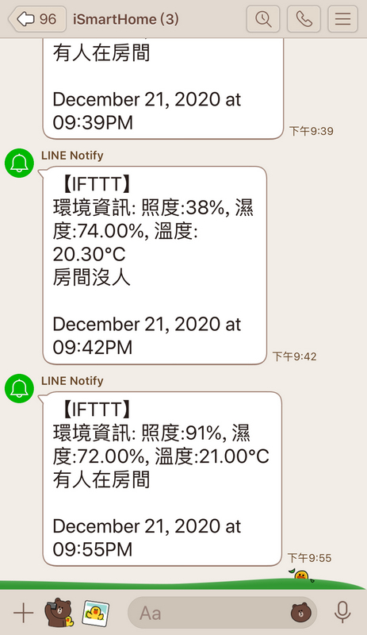

# Smart Home 原型


## 關於這個 repo

這個 repo 是為了幫朋友的教案寫的 demo 系統，所以不算是個很完整的系統。程度只到 "能展示概念" 而已。也因為只是 demo　用途，所以目前也不會再更新它了。

對教案有興趣的，可以看 [Home-Automation_draft.pdf](Home-Automation_draft.pdf) 了解當初設計的初始想法（筆記用的，不算正式的投影片）。


## 硬體


### 開發板

使用的板子是 WeMos-D1-R1。repo 內有兩張圖檔說明它的 pinout 配置。使用這張開發板的原因是因為它長得就是 Arduino UNO 的樣子，對初學者來說或許比較熟悉些。而且它的主要控制晶片其實就是具有 WiFi 功能的 ESP8266，所以可以連網做些 IoT 的應用。但如果我自己要做的話，我會選像是 D1-mini 這樣較小巧的開發板，或是乾脆直接使用 ESP32 的開發板。


### 感測器

因為是 demo 用的，目前只使用下面這幾個感測器:

* (輸入) PIR 人體紅外線感測器
* (輸入) 光敏電阻模組
* (輸入) DHT11 溫溼度感測器
* (輸出) RGB 三色 LED 燈模組


## 關於連網 -- IFTTT

我所使用的是 IFTTT 的服務，你可以把 IFTTT 視為一種整合不同服務的平台。IFTTT 事實上是 IF...THEN 的意思，你可以把 IF 當作是輸入，THEN 當作是收到輸入後的輸出行為。

我在 IFTTT 上建立了一個「IF `收到 WebHook 的請求`，THEN `轉送到 LINE 的某個群組`」的 Applet。這個 Applet 就會是一個結合 WebHook 和 LINE 兩種服務的新服務，這就是 IFTTT 的原始用意。我記得早期 IFTTT 稱這種 mix 的新服務為 Recipe，但現在似乎改稱為 Applet。但從 "Recipe" 的字義上，你應該能夠了解它的用意。


	[WebHook] + [LINE Notify] = My Applet (Recipe)


整體的運作方式是這樣的：你需要寫個的程式對 IFTTT 提供的 "WebHook URL" 送出 HTTP request，然後 IFTTT 將你夾帶的資料轉送給你的 LINE Notify 服務。然後你就可以收到 LINE 訊息了。

	[code running in arduino]==>((HTTP GET/POST))===>[WebHook from IFTTT]--->[LINE Notify]--->[your phone App]

把上面的流程展開來，你可以知道你要處理三個部分：

1. 寫個程式送給 IFTTT 上的 WebHook
2. WebHook 轉送給 LINE 通知服務
3. 處理 LINE 通知到你的手機

其中，2) 的部分是 IFTTT 做的，你只需要在網站上設定即可。所以你真正要處理的部分只有 1) 和 3)。我會建議你先處理 3) 的部分，因為那個部分與程式碼無關。而且 3) 處理完之後，你甚至可以在開始寫程式之前就先測試。

所以你需要取得 LINE Notify 的授權。方法很簡單，只要去 [LINE Notify](https://notify-bot.line.me/zh_TW/) 申請就好。申請成功後，你的 LINE 會多一個叫做 LINE Notify 的機器人好友。

通常使用 LINE Notify 的方式是：你先建立一個聊天群組，然後把 LINE Notify 加入這個群組，或是任何想收到通知的人。例如如果你做的是智慧家庭的應用，你可能會想把你的家人也加入群駔，然後當訊息推播給 LINE Notify 的時候，群組裡面的人都會收到通知。

完成後，你就只剩下 1) 的部分要處理了。

你要先取得 WebHook 的 "REST-Api"，其實這個名詞沒有那麼艱澀，實際上真正做的事情就是對某個 URL 送出一個 HTTP 的 GET 或是 POST。只要進入 IFTTT 的 WebHook 設定頁面，就可以線上測試 WebHook 的呼叫。這讓你你在尚未寫任何一行程式之前，就能先測試從 WebHook 到 LINE 這端是不是通的。


這些測試方式不但可以使用 curl 發送，還可以直接在瀏覽器上貼上 URL 測試，如果你的 LINE 有收到通知，就能證明整段都是打通的。然後你就可以 "寫程式幫你做你剛剛手動測試時所做的事情"。


## 軟體

有 "Test_" 開頭的資料夾是我為了測試 I/O 所寫的測試程式，真正整合在一起的程式是下面這這三個。以下條列的順序就是我開發的進版的順序，你可以使用文件 diff 的工具看出我在每一次版本演進時加了什麼東西。

* Smart_Home -- 最基本的感測控制展示，沒有連網
* Smart_Home_IoT -- 將 Smart_Home 加入連網後的版本
* Smart_Home_IoT_v2 -- 在細部處理 PIR 之後的版本，也是最終 demo 的版本


我必須說我其實還不是很滿意這個程式，不管事流程的控制和寫法上都不算好。但如果這個原型可以幫助到想入門的人，就請盡情拿去修改吧！以下都會以 Smart_Home_IoT_v2 說明。


### 需要修改的部分

#### WiFi 連線

如果你要改 wifi 的 SSID 和密碼，修改這裡：

```
#ifndef STASSID
#define STASSID                 "andrew"
#define STAPSK                  "1234567890"
#endif
```


你其實可以增加很多組 ssid/password。只需要將他們一一 addAP() 進去即可，方法如下：

```
  WiFiMulti.addAP("-andrlin", "1234567890");
```

所以比較好的方式就是寫一個陣列，然後在初始化的時候一一將他們都 add 進去。


### IFTTT 連網

我在程式碼中用來跟 WebHook 溝通的方式是簡單的 HTTP GET，相關的程式片段如下：

你需要改的是 "i-smart-home" 和 "dl1STyaVAEygTVSG" 這兩個字串，他們分別是 event name 和 key。

```
  client.print("GET /trigger/i-smart-home/with/key/dl1STyaVAEygTVSG?value1=" + value1 + "&value2=" + value2 + "&value3=" + value3 +
               " HTTP/1.1\r\n" +
               "Host: maker.ifttt.com\r\n" +
               "Connection: close\r\n\r\n");
```

比較好的寫法是將 event name 和 key 定義為變數。

另外，IFTTT 上透過 WebHook 可以傳送三組 value，使用的名稱就是 value1, value2, value3。目前我只使用了 value1 和 value2。


### 處理中文問題

在網址列上以 HTTP GET 帶入中文資料時，需要經過編碼。為了能正確顯示中文，你需要做 URL 的編碼。你可以在這個網頁 (https://www.urlencoder.org/) 上輸入中文，它會告訴你編碼後的結果。

相關的程式碼片段如下：

```
  String strEnvInfo = String("%E7%92%B0%E5%A2%83%E8%B3%87%E8%A8%8A"); // 環境資訊
  String strLux = String("%E7%85%A7%E5%BA%A6"); // 照度
  String strHum = String("%E6%BF%95%E5%BA%A6"); // 濕度
  String strTmp = String("%E6%BA%AB%E5%BA%A6"); // 溫度
```




## 關於 PIR

其實使用 PIR 時，會遇到兩個問題：

1. PIR 有時候會有雜訊
2. 當 PIR 偵測範圍內的人體靜止不動時，PIR 無法偵測到有人


1) 的影響就是有時候你會在無人的房間內突然收到一個 "有~~人~~~在~~~" 的訊號，嗯...如果在七月的時候，的確會有點恐怖。但通常是環境造成的，所以你需要在你的程式碼中過濾掉這個訊號，過濾的意思就是忽略它，不承認它是控制的依據。有個簡單的做法就是連續出現幾次偵測到有人，我才真正承認真的有人在房間裡。

2) 反而是比較難處理的方式，因為它讓我們無法辨識 "房間裡沒人" 和 "房間裡的人沒動" 這兩種狀況。如果要精確地解決這個問題，通常還會需要額外的感測器輔助。但如果你只想簡單處理，你就必須寫個自己的演算法。例如我假設人不可能超過兩分鐘不動，我就需要寫個程式邏輯 -- 當偵測到無人時，連續兩分鐘內的訊號都是無人才承認。


這裡為了 demo 方便，我直接用偵測 10 次來判斷。當累加偵測 10 次有人，系統才會判定真的有人。累加 10 次都無人，系統才會判定真的無人。


```
  if (detect_count > 10 && detect_count > no_detect_count) {
    current_pir_stat = PIR_DETECTED;
    detect_count = 0;
    no_detect_count = 0;
  }

  if (no_detect_count > 10 && no_detect_count > detect_count) {
    current_pir_stat = (1 - PIR_DETECTED);
    detect_count = 0;
    no_detect_count = 0;
  }
```

但這個寫法還不夠好，它讓反應時間最多能延遲了將近 20 次，還可以再改善。

如果你對 PIR（人體紅外線感測器）有興趣，之前為了研究 PIR 感測器，有花了較多的時間寫了一個小系統，可以參考以下這兩個 repos:

* [iot-i-am-here](https://github.com/andrewintw/iot-i-am-here)
* [pir-motion-detector](https://github.com/andrewintw/pir-motion-detector)


~ END ~